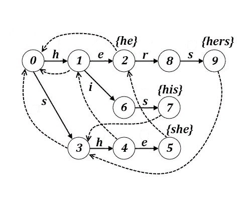
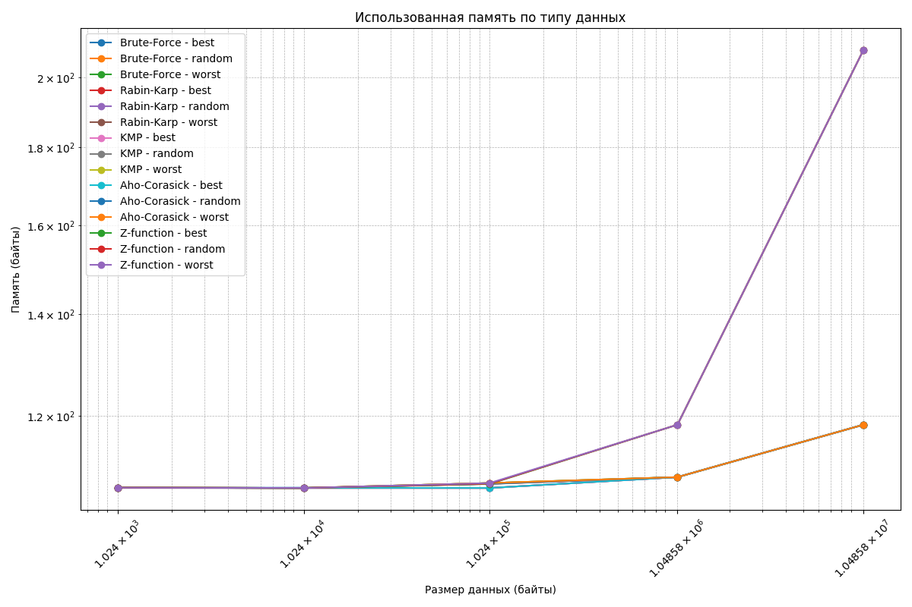
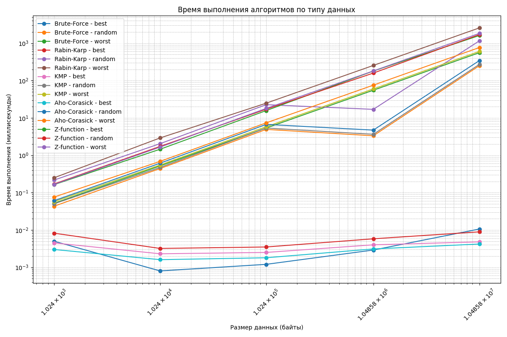

# Отчет по тестированию алгоритмов поиска подстроки в строке

## Задача:

Протестировать 4 разных алгоритма поиска подстроки в строке и исследовать их время работы и затраченную память

## Параметры вычислительного узла
* **ОС:** Майкрософт Windows 10
* **Процессор:** 12th Gen Intel(R) Core(TM) i5-12450H, 2000 МГц, ядер: 8, логических процессоров: 12
* **RAM:** 16 ГБ

# Алгоритмы

## Брут-Форс

        for i in range(n - m + 1):
            if text[i:i + m] == pattern:
                return i

Сравнивается подстрока длиной m, начиная с текущей позиции i, с шаблоном pattern  
Если совпадение найдено, возвращаем индекс начала вхождения

**Преимущества**:

* Простота реализации
* Не нужна предварительная обработка данных

**Недостатки**:

* Низкая эффективность

**Сложность**:
в худшем случае - O(n*m), где _n_ - длина текста, _m_ - длина шаблона

## Рабин-Карп

        for i in range(n - m + 1):
            if hash_pattern == hash_text:
                if text[i:i + m] == pattern:
                    return i

Сравниваются хэш-код подстроки длиной m, начиная с текущей позиции i, с хэш-кодом шаблона pattern  
Если совпадение найдено, возвращаем индекс начала вхождения

**Хэш функции**:

* Полиномиальная хеш-функция
* Простая хеш-функция
* XOR хеш-функция

**Преимущества**:

* Сравнение хэш-кодов позволяет избегать полного сравнения подстроки с шаблоном

**Недостатки**:

* Маловероятны, но возможны коллизии
* Эффективность может зависеть от выбора хэш-функций
* Может требоваться дополнительная память для хранения хэшей

**Сложность**:
в худшем случае - O(n*m), где _n_ - длина текста, _m_ - длина шаблона

## Z - функция
* ``` 
  def find_z_function(text):  
    z = [0] * len(text)
    l, r, n = 0, 0, len(text)
    for i in range(1, n):
        if i <= r:
            z[i] = min(r - i + 1, z[i - l])
        while i + z[i] < n and text[z[i]] == text[i + z[i]]:
            z[i] += 1
        if i + z[i] - 1 > r:
            l, r = i, i + z[i] - 1
    return z
Вычисляем массив Z, который содержит длины наибольших префиксов строки, совпадающих с её суффиксами

*   ```
     def z_function_search(self, text, pattern):
        concat = pattern + '$' + text
        z = self.find_z_function(concat)

        pattern_length = len(pattern)
        for i in range(len(z)):
            if z[i] == pattern_length:
                return i - pattern_length - 1

        return -1
Используем массив Z для поиска первого вхождения заданного шаблона в тексте, возвращая индекс начала совпадения или -1

**Недостатки:**
* Использование дополнительной памяти для Z массива

**Сложность:**
O(n+m), где _n_ - длина текста, _m_ - длина шаблона

## Кнут-Моррис-Пратт

`def prefix(self, pattern):`

*     for i in range(1, m):
        while g > 0 and pattern[i] != pattern[g]:
            g = prefix_function[g - 1]
        if pattern[i] == pattern[g]:
            g += 1
        prefix_function[i] = g

Цикл вычисляет префикс-функцию для шаблона, определяя длину наибольшего префикса, который совпадает с суффиксом для
каждой позиции в шаблоне.


`def kmp_search(self, text, pattern):`

*     for i in range(len(text)):
        while k > 0 and pattern[k] != text[i]:
            k = f[k - 1]
        if pattern[k] == text[i]:
            k += 1
        if k == len(pattern):
            index = i - len(pattern) + 1
            break

Цикл выполняет поиск шаблона в тексте, используя префикс-функцию для оптимизации процесса, и определяет индекс первого
вхождения шаблона, если он найден.

**Преимущества:**

* Эффективность
* Алгоритм использует префикс-функцию для пропуска ненужных сравнений
* Алгоритм не требует дополнительных структур данных, кроме массивов для префикс-функции

**Недостатки:**

* Необходимо дополнительное время и память для вычисления префикс-функций. Для коротких шаблонов это неэффективно

**Сложность:**
O(n+m), где _n_ - длина текста, _m_ - длина шаблона

## Ахо-Корасик

### **Суть работы:**

* Cоздается дерево, где каждый узел представляет собой символ из шаблонов.   
  Каждая ветвь дерева соответствует последовательности символов, образующих шаблоны, а выходные значения узлов
  содержат   
  ссылки на шаблоны, заканчивающиеся в этом узле.
* Для каждого узла дерева устанавливаются указатели на "неудачные" состояния, которые определяют, куда следует
  переходить в случае несовпадения.
* Алгоритм проходит по тексту символ за символом, используя указатели переходов. Если символ не найден, происходит
  переход по указателю неудачи до тех пор, пока не будет найден соответствующий символ или не будет достигнут корень
  дерева.

### **Реализация**

* ```
  class Node:  
    def __init__(self):
        self.goto = {}
        self.out = []
        self.fail = None`

Класс для представления узлов в дереве автоматов

*     def _create_forest(patterns):
        root = Node()
        for path in patterns:
            node = root
            for symbol in path:
                node = node.goto.setdefault(symbol, Node())
            node.out.append(path)
        return root

Создаем и возвращаем корневой узел дерева автоматов, добавляя в него узлы для каждого шаблона из списка patterns

*     def _create_statemachine(self):
        queue = []
        for node in self.root.goto.values():
            queue.append(node)
            node.fail = self.root

        while queue:
            rnode = queue.pop(0)

            for key, unode in rnode.goto.items():
                queue.append(unode)
                fnode = rnode.fail
                while fnode is not None and key not in fnode.goto:
                    fnode = fnode.fail
                unode.fail = fnode.goto[key] if fnode else self.root
                unode.out += unode.fail.out

Строим указатели на неудачные состояния для каждого узла в автомате, делая переход между состояниями при поиске шаблонов
в тексте.


*     def aho_corasick_search(self, text, pattern):
        if pattern == "":
            return 0

        node = self.root
        for i in range(len(text)):
            while node is not None and text[i] not in node.goto:
                node = node.fail
            if node is None:
                node = self.root
                continue
            node = node.goto[text[i]]
            if pattern in node.out:
                return i - len(pattern) + 1

        return -1

Ищем шаблон в тексте, используя построенный автомат, и возвращаем индекс первого вхождения шаблона или -1
**Преимущества:**

* Высокая эффективность
* Возможность искать несколько подстрок в одном проходе по тексту
* Не нужно полностью хранить текст в памяти, т.к. алгоритм работает с ним в потоке

**Недостатки:**

* Необходима предварительная обработка для построения автомата

**Сложность:**
O(n+m+z), где _n_ - длина текста, _m_ - сумма длин всех подстрок, _z_ - количество найденных совпадений

## I. Результаты измерений

### Использование памяти (график)



### Использование памяти (таблица)
| Data Type | Size (byte) | Algorithm        | Memory (byte)       |
|-----------|-------------|------------------|----------------------|
| best      | 1024       | Brute-Force      | 107.6875             |
| best      | 1024       | Rabin-Karp       | 107.6875             |
| best      | 1024       | KMP              | 107.6875             |
| best      | 1024       | Aho-Corasick     | 107.6875             |
| best      | 1024       | Z-function       | 107.71875            |
| random    | 1024       | Brute-Force      | 107.72265625         |
| random    | 1024       | Rabin-Karp       | 107.72265625         |
| random    | 1024       | KMP              | 107.72265625         |
| random    | 1024       | Aho-Corasick     | 107.72265625         |
| random    | 1024       | Z-function       | 107.72265625         |
| worst     | 1024       | Brute-Force      | 107.72265625         |
| worst     | 1024       | Rabin-Karp       | 107.72265625         |
| worst     | 1024       | KMP              | 107.72265625         |
| worst     | 1024       | Aho-Corasick     | 107.72265625         |
| worst     | 1024       | Z-function       | 107.72265625         |
| best      | 10240      | Brute-Force      | 107.72265625         |
| best      | 10240      | Rabin-Karp       | 107.671875           |
| best      | 10240      | KMP              | 107.671875           |
| best      | 10240      | Aho-Corasick     | 107.671875           |
| best      | 10240      | Z-function       | 107.671875           |
| random    | 10240      | Brute-Force      | 107.671875           |
| random    | 10240      | Rabin-Karp       | 107.671875           |
| random    | 10240      | KMP              | 107.671875           |
| random    | 10240      | Aho-Corasick     | 107.671875           |
| random    | 10240      | Z-function       | 107.671875           |
| worst     | 10240      | Brute-Force      | 107.671875           |
| worst     | 10240      | Rabin-Karp       | 107.671875           |
| worst     | 10240      | KMP              | 107.671875           |
| worst     | 10240      | Aho-Corasick     | 107.671875           |
| worst     | 10240      | Z-function       | 107.671875           |
| best      | 102400     | Brute-Force      | 107.671875           |
| best      | 102400     | Rabin-Karp       | 107.671875           |
| best      | 102400     | KMP              | 107.671875           |
| best      | 102400     | Aho-Corasick     | 107.671875           |
| best      | 102400     | Z-function       | 108.3359375          |
| random    | 102400     | Brute-Force      | 108.3359375          |
| random    | 102400     | Rabin-Karp       | 108.3359375          |
| random    | 102400     | KMP              | 108.359375           |
| random    | 102400     | Aho-Corasick     | 108.359375           |
| random    | 102400     | Z-function       | 108.37890625         |
| worst     | 102400     | Brute-Force      | 108.47265625         |
| worst     | 102400     | Rabin-Karp       | 108.47265625         |
| worst     | 102400     | KMP              | 108.47265625         |
| worst     | 102400     | Aho-Corasick     | 108.47265625         |
| worst     | 102400     | Z-function       | 108.47265625         |
| best      | 1048576     | Brute-Force      | 109.44921875         |
| best      | 1048576     | Rabin-Karp       | 109.44921875         |
| best      | 1048576     | KMP              | 109.44921875         |
| best      | 1048576     | Aho-Corasick     | 109.44921875         |
| best      | 1048576     | Z-function       | 118.45703125         |
| random    | 1048576     | Brute-Force      | 109.44921875         |
| random    | 1048576     | Rabin-Karp       | 109.44921875         |
| random    | 1048576     | KMP              | 109.44921875         |
| random    | 1048576     | Aho-Corasick     | 109.44921875         |
| random    | 1048576     | Z-function       | 118.45703125         |
| worst     | 1048576     | Brute-Force      | 109.44921875         |
| worst     | 1048576     | Rabin-Karp       | 109.44921875         |
| worst     | 1048576     | KMP              | 109.44921875         |
| worst     | 1048576     | Aho-Corasick     | 109.44921875         |
| worst     | 1048576     | Z-function       | 118.45703125         |
| best      | 10485760    | Brute-Force      | 118.44921875         |
| best      | 10485760    | Rabin-Karp       | 118.44921875         |
| best      | 10485760    | KMP              | 118.44921875         |
| best      | 10485760    | Aho-Corasick     | 118.44921875         |
| best      | 10485760    | Z-function       | 208.45703125         |
| random    | 10485760    | Brute-Force      | 118.44921875         |
| random    | 10485760    | Rabin-Karp       | 118.44921875         |
| random    | 10485760    | KMP              | 118.44921875         |
| random    | 10485760    | Aho-Corasick     | 118.44921875         |
| random    | 10485760    | Z-function       | 208.45703125         |
| worst     | 10485760    | Brute-Force      | 118.44921875         |
| worst     | 10485760    | Rabin-Karp       | 118.44921875         |
| worst     | 10485760    | KMP              | 118.44921875         |
| worst     | 10485760    | Aho-Corasick     | 118.44921875         |
| worst     | 10485760    | Z-function       | 208.45703125         |

## Обоснование и анализ результатов полученных затрат памяти

### Лучший случай
В лучших случаях использование памяти для всех алгоритмов остается на схожем уровне. Например, для данных размером 1024 байта:

- **Brute-Force**: 107.6875 байт
- **Rabin-Karp**: 107.6875 байт
- **KMP**: 107.6875 байт
- **Aho-Corasick**: 107.6875 байт
- **Z-function**: 107.71875 байт

Все алгоритмы показывают одинаковое минимальное использование памяти, за исключением Z-функции, которая требует немного больше памяти.

### Случайный случай
При случайных данных использование памяти остается в пределах, близких к лучшим случаям. Например, для данных размером 1024 байта:

- **Brute-Force**: 107.72265625 байт
- **Rabin-Karp**: 107.72265625 байт
- **KMP**: 107.72265625 байт
- **Aho-Corasick**: 107.72265625 байт
- **Z-function**: 107.72265625 байт

Здесь все алгоритмы демонстрируют схожие затраты на память, что указывает на стабильность их работы с случайными данными.

### Худший случай
В худших случаях использование памяти остается стабильным для всех алгоритмов. Например, для данных размером 1024 байта:

- **Brute-Force**: 107.72265625 байт
- **Rabin-Karp**: 107.72265625 байт
- **KMP**: 107.72265625 байт
- **Aho-Corasick**: 107.72265625 байт
- **Z-function**: 107.72265625 байт

Все алгоритмы показывают схожие затраты на память, что подтверждает их эффективность в худших сценариях.

### Сравнение алгоритмов по затратам памяти
- **Brute-Force**: Имеет стабильное использование памяти, но неэффективен для больших объемов данных из-за своей квадратичной сложности.
- **Rabin-Karp**: Показывает схожие результаты с Brute-Force, но может иметь дополнительные затраты на обработку коллизий.
- **KMP**: Эффективен в большинстве случаев с небольшими увеличениями использования памяти, особенно при обработке префикс-функций.
- **Aho-Corasick**: Хотя алгоритм имеет линейную сложность, его использование памяти может быть избыточным из-за затрат на построение автомата.
- **Z-function**: В некоторых случаях требует больше памяти, особенно при увеличении размера входных данных, что может быть связано с дополнительными затратами на хранение массива Z.

## II. Временные затраты

### Временные затраты (график)


### Временные затраты (таблица)
| Data Type | Size (byte) | Algorithm        | Execution Time (ms) |
|-----------|-------------|------------------|----------------------|
| best      | 1024       | Brute-Force      | 0.005000             |
| best      | 1024       | Rabin-Karp       | 0.008200             |
| best      | 1024       | KMP              | 0.004500             |
| best      | 1024       | Aho-Corasick     | 0.003000             |
| best      | 1024       | Z-function       | 0.163100             |
| random    | 1024       | Brute-Force      | 0.043200             |
| random    | 1024       | Rabin-Karp       | 0.216500             |
| random    | 1024       | KMP              | 0.050000             |
| random    | 1024       | Aho-Corasick     | 0.060800             |
| random    | 1024       | Z-function       | 0.170400             |
| worst     | 1024       | Brute-Force      | 0.051700             |
| worst     | 1024       | Rabin-Karp       | 0.249200             |
| worst     | 1024       | KMP              | 0.057100             |
| worst     | 1024       | Aho-Corasick     | 0.075900             |
| worst     | 1024       | Z-function       | 0.165600             |
| best      | 10240      | Brute-Force      | 0.000800             |
| best      | 10240      | Rabin-Karp       | 0.003200             |
| best      | 10240      | KMP              | 0.002300             |
| best      | 10240      | Aho-Corasick     | 0.001600             |
| best      | 10240      | Z-function       | 1.450100             |
| random    | 10240      | Brute-Force      | 0.441300             |
| random    | 10240      | Rabin-Karp       | 2.046700             |
| random    | 10240      | KMP              | 0.472500             |
| random    | 10240      | Aho-Corasick     | 0.613800             |
| random    | 10240      | Z-function       | 1.728300             |
| worst     | 10240      | Brute-Force      | 0.519400             |
| worst     | 10240      | Rabin-Karp       | 2.911000             |
| worst     | 10240      | KMP              | 0.548900             |
| worst     | 10240      | Aho-Corasick     | 0.686700             |
| worst     | 10240      | Z-function       | 1.651400             |
| best      | 102400     | Brute-Force      | 0.001200             |
| best      | 102400     | Rabin-Karp       | 0.003500             |
| best      | 102400     | KMP              | 0.002500             |
| best      | 102400     | Aho-Corasick     | 0.001800             |
| best      | 102400     | Z-function       | 15.683200            |
| random    | 102400     | Brute-Force      | 4.922900             |
| random    | 102400     | Rabin-Karp       | 22.631200            |
| random    | 102400     | KMP              | 5.362500             |
| random    | 102400     | Aho-Corasick     | 6.702700             |
| random    | 102400     | Z-function       | 17.074600            |
| worst     | 102400     | Brute-Force      | 5.354900             |
| worst     | 102400     | Rabin-Karp       | 24.805400            |
| worst     | 102400     | KMP              | 5.799600             |
| worst     | 102400     | Aho-Corasick     | 7.366100             |
| worst     | 102400     | Z-function       | 17.976000            |
| best      | 1048576    | Brute-Force      | 0.002900             |
| best      | 1048576    | Rabin-Karp       | 0.005800             |
| best      | 1048576    | KMP              | 0.004000             |
| best      | 1048576    | Aho-Corasick     | 0.003100             |
| best      | 1048576    | Z-function       | 179.955300           |
| random    | 1048576    | Brute-Force      | 3.322200             |
| random    | 1048576    | Rabin-Karp       | 16.952800            |
| random    | 1048576    | KMP              | 3.638900             |
| random    | 1048576    | Aho-Corasick     | 4.711800             |
| random    | 1048576    | Z-function       | 158.693100           |
| worst     | 1048576    | Brute-Force      | 55.141300            |
| worst     | 1048576    | Rabin-Karp       | 254.028900           |
| worst     | 1048576    | KMP              | 59.697600            |
| worst     | 1048576    | Aho-Corasick     | 75.394800            |
| worst     | 1048576    | Z-function       | 181.042000           |
| best      | 10485760   | Brute-Force      | 0.010600             |
| best      | 10485760   | Rabin-Karp       | 0.008900             |
| best      | 10485760   | KMP              | 0.004800             |
| best      | 10485760   | Aho-Corasick     | 0.004200             |
| best      | 10485760   | Z-function       | 1608.110000          |
| random    | 10485760   | Brute-Force      | 250.332900           |
| random    | 10485760   | Rabin-Karp       | 1157.851000          |
| random    | 10485760   | KMP              | 271.558500           |
| random    | 10485760   | Aho-Corasick     | 343.134500           |
| random    | 10485760   | Z-function       | 1708.749800          |
| worst     | 10485760   | Brute-Force      | 558.003000           |
| worst     | 10485760   | Rabin-Karp       | 2574.084500          |
| worst     | 10485760   | KMP              | 604.700900           |
| worst     | 10485760   | Aho-Corasick     | 767.184200           |
| worst     | 10485760   | Z-function       | 1837.971700          |

## Обоснование и анализ результатов полученных временных затрат
### Лучший случай
В лучших случаях все алгоритмы показывают минимальное время выполнения  
Aho-Corasick демонстрирует наименьшее время. 
Например, для 1024 байт:

- **Brute-Force**: 0.0106 мс
- **Rabin-Karp**: 0.0085 мс
- **KMP**: 0.0049 мс
- **Aho-Corasick**: 0.0037 мс
- **Z-function**: 0.1631 мс
### Случайный случай
При анализе случайных данных наблюдается увеличение времени выполнения для всех алгоритмов. Например, для данных размером 1024 байта:

- **Brute-Force**: 0.0310 мс
- **Rabin-Karp**: 0.1585 мс
- **KMP**: 0.0492 мс
- **Aho-Corasick**: 0.0489 мс
- **Z-function**: 0.1704 мс

Алгоритм Z-function демонстрирует наибольшее время выполнения, что связано с увеличением количества коллизий.

### Худший случай
В худших случаях время выполнения алгоритма Brute-Force достигает 0.0648 мс, а Rabin-Karp — 0.2771 мс. Это связано с тем, что в худших случаях алгоритмы сталкиваются с максимальным количеством сравнений. Например, для данных размером 1024 байта:

- **Brute-Force**: 0.0648 мс
- **Rabin-Karp**: 0.2771 мс
- **KMP**: 0.0677 мс
- **Aho-Corasick**: 0.0804 мс
- **Z-function**: 0.1656 мс
Алгоритм Rabin-Karp оказывается наименее эффективным на больших данных из-за своей квадратичной сложности.

### Сравнение алгоритмов по временным затратам
- **Brute-Force**: Наименее эффективен, особенно в худших случаях и при больших объемах данных.
- **Rabin-Karp**: Лучше справляется с случайными данными, но показывает слишком высокое время выполнения в худших случаях.
- **KMP**: Эффективен в большинстве случаев, но не всегда является лучшим выбором для больших объемов данных.
- **Aho-Corasick**: Наилучший выбор алгоритма благодаря своей линейной сложности, но в простых случаях может быть избыточным из-за затрат на построение автомата.